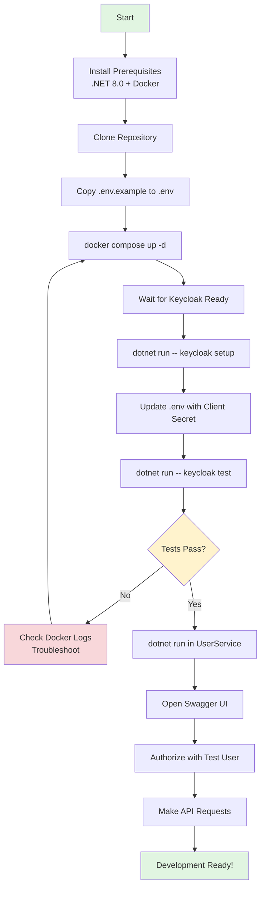
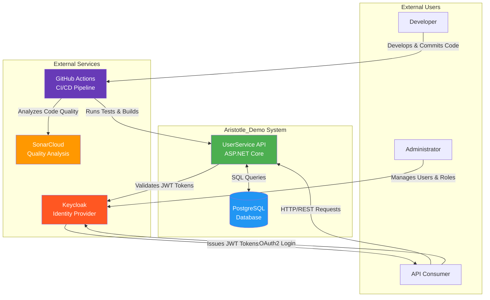

## Table of Contents

  

1. [Welcome to Aristotle_Demo](#1-welcome-to-aristotle_demo)

2. [Quick Start (15-Minute Setup)](#2-quick-start-15-minute-setup)

3. [Project Structure Overview](#3-project-structure-overview)

4. [Development Workflows](#4-development-workflows)

5. [Key Concepts (Non-Technical)](#5-key-concepts-non-technical)

  

---

  

# Welcome to Aristotle_Demo

  

## What is Aristotle_Demo?

  

Aristotle_Demo is an **ASP.NET Core User Management API** designed as an educational platform to demonstrate modern .NET development practices and Clean Architecture principles. This project serves as a learning exercise comparing C#/.NET development patterns with Java/Spring Boot.

  

**Key Characteristics**:

- Production-quality code structure

- Real-world authentication using OAuth2/OIDC (Keycloak)

- Quality assurance (104 unit tests, SonarCloud integration)

- Docker-based infrastructure

- CI/CD pipeline with automated testing

  

## Project Vision and Goals

  

The project was created with specific learning objectives:

  
**Primary Goals**:

- **Demonstrate Clean Architecture**: Show how to structure applications with clear layer separation and dependency management

- **Modern .NET Practices**: Showcase .NET 8.0 features, async/await patterns, and dependency injection

- **Enterprise Authentication**: Implement OAuth2/OIDC using industry-standard tools (Keycloak)

- **Quality-First Development**: Maintain high code coverage (target: 80%) and use static analysis tools

- **Developer Experience**: Provide automated setup, clear documentation, and productive workflows
 

**Technology Stack**:

- .NET 8.0 (LTS)

- PostgreSQL 15

- Keycloak 26.0

- Docker & Docker Compose

- GitHub Actions for CI/CD

- SonarCloud for quality analysis

---

# Quick Start

This section will get you from zero to a running API using automated setup tools.

## Prerequisites Checklist

Before starting, ensure you have the following installed:

**Required**:

- **.NET 8.0 SDK** - [Download here](https://dotnet.microsoft.com/download/dotnet/8.0)

  - Verify installation: `dotnet --version` (should show 8.0.x)

- **Docker Desktop** - [Download here](https://www.docker.com/products/docker-desktop/)

  - Required for Keycloak and PostgreSQL

  - Verify installation: `docker --version`

  - Make sure Docker is running before proceeding


**Recommended**:

- **IDE**: Choose one

  - [JetBrains Rider](https://www.jetbrains.com/rider/) (recommended for .NET)

  - [Visual Studio 2022](https://visualstudio.microsoft.com/)

  - [Visual Studio Code](https://code.visualstudio.com/) with C# DevKit extension

- **Git** - For cloning the repository

- **cURL** or **Postman** - For API testing (optional, Swagger UI included)

  
**System Requirements**:

- Operating System: Windows 10/11, macOS 11+, or Linux

- RAM: 8GB minimum, 16GB recommended

- Disk Space: 5GB free space

  

## Step-by-Step Automated Setup

### Step 1: Clone and Configure Environment

```bash
# Clone the repository
git clone https://github.com/mayconht/Aristotle_Demo.git

cd Aristotle_Demo

# Create environment file from template
cp .env.example .env

# (Optional) Review and modify .env if needed
# Default values work for local development

```

**What's in .env**:

```
POSTGRES_HOST=postgres
POSTGRES_DB=userservice_db
POSTGRES_USER=postgres
POSTGRES_PASSWORD=password
KEYCLOAK_URL=http://localhost:8080
ASPNETCORE_ENVIRONMENT=Development
```


### Step 2: Start Infrastructure Services
Start PostgreSQL and Keycloak using Docker Compose:
```bash
# Start infrastructure (PostgreSQL + Keycloak)
docker compose up -d postgres keycloak
  
# Verify containers are running
docker ps

# Expected output: postgres and keycloak containers running
``` 

**Wait for Services**:
- PostgreSQL typically starts in ~10 seconds
- Keycloak may take 30-60 seconds on first run (downloading and initializing)

**Verify Keycloak is Ready**:

```bash
# Check Keycloak health endpoint
curl http://localhost:8080/health/ready

# Should return: {"status":"UP",...}
```

### Step 3: Run Automated Keycloak Setup

The DevTools CLI automates the entire Keycloak configuration:

```bash
# Navigate to DevTools
cd Aristotle.DevTools

# Run automated Keycloak setup
dotnet run -- keycloak setup
```

**What This Creates**:
- Realm: `userservice`
- API Client: `userservice-api` (confidential, for backend)
- Mobile Client: `userservice-mobile` (public, PKCE-enabled)
- Roles: `Admins`, `Managers`, `Users`
- Groups: `admin-group`, `manager-group`, `user-group`
- Test Users:
  - `admin` / `admin123` (Admins role)
  - `manager` / `manager123` (Managers role)
  - `user` / `user123` (Users role)
- Protocol Mappers: For roles and groups in JWT tokens
  
**Expected Output**:
```
Creating realm 'userservice'...
Creating client 'userservice-api'...
Generating client secret...
Client Secret: dev-client-secret-12345
Creating roles...
Creating groups...
Creating test users...
Setup completed successfully!
```

### Step 4: Update Environment Configuration

Copy the generated client secret to your `.env` file:

```bash
# Return to project root
cd ..

# Edit .env and add/update:
KEYCLOAK_CLIENT_SECRET=dev-client-secret-12345
```

For CI/CD and consistency, the setup uses a **fixed secret** (`dev-client-secret-12345`) in development mode.

### Step 5: Validate Setup

Test that Keycloak authentication works:

```bash
# Run authentication tests
cd Aristotle.DevTools
dotnet run -- keycloak test

# Expected: Successful authentication for all 3 test users
```

#### Step 6: Start the API

Now start the UserService API:

```bash
# Navigate to UserService
cd ../USR/UserService

# Run the API
dotnet run

# Or use watch mode for hot reload:
dotnet watch
```

**Expected Output**:
```
Building...
info: UserService API starting...
info: Environment: Development
info: Now listening on: http://localhost:3000
info: Application started. Press Ctrl+C to shut down.
```

### Step 7: Make Your First API Call
The application automatically opens Swagger UI in your browser when running in Development mode.

**Manual Access**:
- Swagger UI: http://localhost:3000/swagger
- API Base: http://localhost:3000/api

**Test Authentication**:
1. Open Swagger UI: http://localhost:3000/swagger
2. Click the **Authorize** button (green lock icon)
3. Leave all scopes checked, click **Authorize**
4. Browser opens Keycloak login page
5. Login with test credentials:
   - Username: `admin`
   - Password: `admin123`
6. You're redirected back to Swagger with an authenticated session
7. Try the **GET /api/users/me** endpoint to see your user profile

**Expected Response**:
```json
{
  "externalUserId": "04bbb802-ebf6-4403-b6d0-6060612c8a9",
  "createdAt": "2026-01-03T10:30:00Z"
}
```
## Verification Steps

Confirm everything is working:

**1. Health Checks**:
```bash
# Check API health
curl http://localhost:3000/health

# Should return: Healthy
```
**2. Database Connection**:

```bash
# Connect to PostgreSQL
docker exec -it postgres psql -U postgres -d userservice_db

# Inside psql:
\dt  # List tables (should see "Users")
\q   # Exit
```

**3. Keycloak Admin Console**:
- URL: http://localhost:8080
- Login: `admin` / `admin`
- Navigate to: `userservice` realm
- Verify clients, roles, groups, and users

**4. Authenticated API Request**:
```bash
# Get token (replace with actual values)
TOKEN=$(curl -X POST "http://localhost:8080/realms/userservice/protocol/openid-connect/token" \
  -d "client_id=userservice-api" \
  -d "client_secret=dev-client-secret-12345" \
  -d "username=admin" \
  -d "password=admin123" \
  -d "grant_type=password" | jq -r '.access_token')

# Call API with token
curl -H "Authorization: Bearer $TOKEN" http://localhost:3000/api/users/me
```

### Quick Start Flowchart


---

  

# Project Structure Overview

## Repository Organization

```
Aristotle_Demo/
|
├── Aristotle.DevTools/        # Development utilities CLI
│   ├── Commands/              # Keycloak setup/test commands
│   ├── Program.cs             # CLI entry point
│   └── README.md              # DevTools documentation
├── bruno/                     # API integration tests
│   └── UserService API/       # Bruno test collection
├── docker/                    # Docker configuration files
│   └── postgres-init.sql      # PostgreSQL initialization
├── USR/
│   ├── UserService/           # Main API application
│   │   ├── Application/       # Business logic layer
│   │   ├── Controllers/       # API endpoints
│   │   ├── Domain/            # Core business entities
│   │   ├── Infrastructure/    # Data access & external services
│   │   ├── Properties/        # Launch settings
│   │   ├── Program.cs         # Application entry point
│   │   └── appsettings.json   # Configuration
│   └── UserServiceTests/      # Unit tests (xUnit)
├── .env.example               # Environment template
├── .gitignore
├── Aristotle_Demo.sln         # Solution file
├── docker-compose.yml         # Infrastructure services
└── README.md                  # Quick reference guide

```

## Technology Stack Summary

### Backend Framework

- **.NET 8.0 (LTS)** - Modern, cross-platform framework
- **ASP.NET Core Web API** - REST API framework
- **C# 12** - Latest language features

### Database & ORM
- **PostgreSQL 15** - Relational database
- **Entity Framework Core 8.0** - Object-Relational Mapper
- **Npgsql** - PostgreSQL provider for EF Core

### Authentication & Authorization
- **Keycloak 26.0** - OAuth2/OIDC identity provider
- **JWT Bearer** - Token-based authentication
- **Microsoft.AspNetCore.Authentication.JwtBearer** - JWT validation

### API Documentation
- **Swagger/OpenAPI** - Interactive API documentation
- **Swashbuckle.AspNetCore** - Swagger generator for .NET


### Testing & Quality
- **xUnit v3** - Unit testing framework
- **Moq** - Mocking library for tests
- **Bogus** - Fake data generation
- **Coverlet** - Code coverage tool
- **SonarCloud** - Static code analysis
- **Bruno CLI** - API integration testing

### DevOps & Infrastructure
- **Docker & Docker Compose** - Containerization
- **GitHub Actions** - CI/CD pipeline
- **Git** - Version control

### Utilities
- **AutoMapper** - Object-to-object mapping
- **DotNetEnv** - Environment variable management
- **System.CommandLine** - CLI framework for DevTools

### Key Directories Explained

**Application Layer** (`USR/UserService/Application/`):
- Business logic and use cases
- Service interfaces and implementations
- DTOs (Data Transfer Objects) for API contracts
- Validators for business rules
- Authorization policies

**Domain Layer** (`USR/UserService/Domain/`):
- Core business entities (User)
- Repository interfaces
- Domain exceptions
- Business rules independent of technology


**Infrastructure Layer** (`USR/UserService/Infrastructure/`):
- Database context and configurations
- Repository implementations
- Middleware (JIT provisioning, exception handling)
- Authentication/authorization setup
- Health checks

**Controllers** (`USR/UserService/Controllers/`):
- REST API endpoints
- HTTP request/response handling
- Attribute-based routing and authorization

 **CI Pipeline Runs Automatically**:

   - Build and unit tests
   - SonarCloud analysis
   - Integration tests
   - Results visible in Azure pipeline Test tab
  
## Testing Changes

**Unit Tests**:

```bash
# Run all tests
dotnet test

# Run with detailed output
dotnet test --logger "console;verbosity=detailed"

# Run tests in specific project
dotnet test USR/UserServiceTests/UserService.UnitTests.csproj

# Run with coverage
Dotne test --collect:"XPlat Code Coverage"
```

**Integration Tests with Bruno**:

```bash
# Install Bruno CLI (once)
npm install -g @usebruno/cli

# Run API tests
bruno run "bruno/UserService API" --env "Local Development"
```

**Manual Testing with Swagger**:
- Navigate to http://localhost:3000/swagger
- Click Authorize button
- Login with test user
- Execute endpoints interactively
- View request/response details

## Common Development Tasks

**Add a New Endpoint**
1. Create DTO in `Application/DTOs/`
2. Add service method in `Application/Services/`
3. Add controller action in `Controllers/`
4. Add unit tests in `UserServiceTests/`
5. Test with Swagger UI

**Modify Business Logic**:
1. Update service in `Application/Services/`
2. Update corresponding unit tests
3. Run tests: `dotnet test`
4. Test with Swagger UI

**Change Database Schema**:
1. Update entity in `Domain/Entities/`
2. Update configuration in `Infrastructure/Persistence/Configurations/`
3. Delete database: `docker compose down -v`
4. Restart application (auto-creates schema)
5. Test changes

**Update Dependencies**:

```bash
# List outdated packages
dotnet list package --outdated

# Update specific package
dotnet add package <PackageName> --version <Version>

# Update all packages (careful!)
dotnet outdated --upgrade
```
  

# System Context Diagram


The following diagram shows how Aristotle_Demo interacts with external systems:  



---

  

## Next Steps

  

Now that you have the application running:

  

1. **Explore the API**: Try different endpoints in Swagger UI

2. **Understand the Architecture**: Read [Clean Architecture Deep Dive](./02-clean-architecture.md)

3. **Learn About Authentication**: Read [Keycloak Integration Guide](./03-keycloak-integration.md)

4. **Start Developing**: Read [Development Guide](./04-development-guide.md)

5. **Understand Quality Processes**: Read [CI/CD and Quality Assurance](./05-cicd-quality.md)
